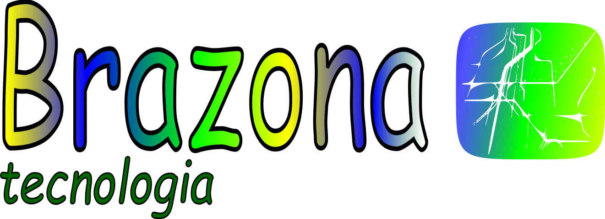

### DESCRIÇÃO DO PROJETO

A Brazona tecnologia é uma companhia de desenvolvimento de software oferecendo ao mercado público e privado, produtos de gerenciamento empresarial para os diversos setores da economia, serviços de consultoria e desenvolvimento de sistemas.

### STATUS DO PROJETO

> Status do Projeto: Em andamento

### DOCUMENTAÇÃO

- [WIKI PROJETO](https://github.com/brazona/.github/wiki)

## **AUTOR**
---

Feito com ❤️ por Cézar Felipe 👋🏽 Entre em contato!

 
  
   
    
## LICENÇA

<!--

**Here are some ideas to get you started:**

🙋‍♀️ A short introduction - what is your organization all about?
🌈 Contribution guidelines - how can the community get involved?
👩‍💻 Useful resources - where can the community find your docs? Is there anything else the community should know?
🍿 Fun facts - what does your team eat for breakfast?
🧙 Remember, you can do mighty things with the power of [Markdown](https://docs.github.com/github/writing-on-github/getting-started-with-writing-and-formatting-on-github/basic-writing-and-formatting-syntax)
-->
