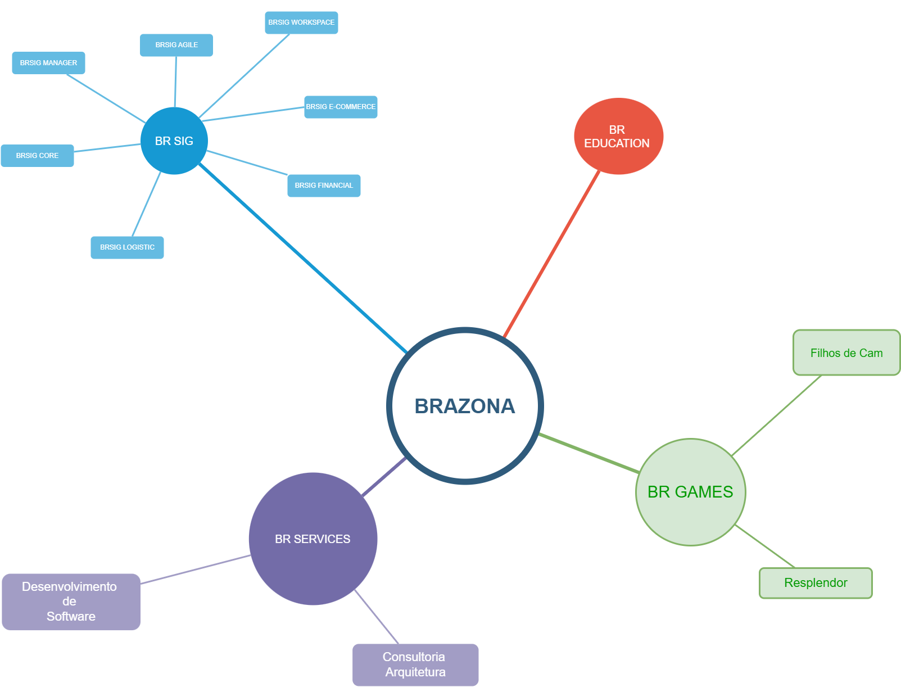

## TABELA DE CONTEÚDOS
---

 <!--ts-->
   * [INTRODUÇÃO](#INTRODUÇÃO)
   * [STATUS](#STATUS)
   * [DESCRIÇÃO](#DESCRIÇÃO)
   * [MAPA DE SETORES](#MAPA_DE_SETORES)
   * [BRSIG](#BRSIG)
   * [BRGAMES](#BRGAMES)
   * [BRSERVICES](#BRSERVICES)
   * [BREDUCATION](#BREDUCATION)
   * [DOCUMENTACAO](#DOCUMENTACAO)
   * [LICENÇA](#LICENÇA)
<!--te-->

### INTRODUÇÃO
---

A Brazona tecnologia é uma companhia de desenvolvimento de software oferecendo ao mercado público e privado, produtos de gerenciamento empresarial para os diversos setores da economia, serviços de consultoria e desenvolvimento de sistemas.

### STATUS

> Status do Projeto: Em andamento

### DESCRIÇÃO
---

A empresa tem forte envolvimento com o setor da tecnologia, buscando sempre a melhoria contínua adaptando às mudanças do mercado interno e externo para aprimorar o conhecimento e experiência que proporcionará a qualidade e segurança das aplicações.

Uma das principais propostas da organização é oferecer aos clientes uma diversidade de produtos gerenciais para setores econômicos da sociedade que funcionam integrados ou individualmente, além de ter presença no setor tecnológico de entretenimento tanto para lazer quanto educacional.

A Brazona Tech reúne 4 setores de atuação dentro do mercado tecnológico, definidos e  diversificados para atender às variadas demandas do mercado.

### MAPA_DE_SETORES
---

### BRSIG
---

Este catálogo de software focado em fornecer ferramentas de gestão e gerência empresarial, oferecendo soluções a diversos segmentos do mercado público e privado, desde e-commerce, desenvolvimento de software, logística internacional e a gestão da cadeia de suprimentos até a gestão financeira.

### BRGAMES
---

Este setor da Brazona responsável pelo desenvolvimento de jogos digitais, um nicho pouco investido no Brasil mas que possui um dos maiores mercados consumidores de games.

### BRSERVICES
---

O conhecimento e experiência adquirido nos processos de desenvolvimento das próprias aplicações também são ofertados ao mercado, com profissionais qualificados e estrutura organizacional pronta para o setor de tecnologia, a Branoza BR Service tem como proposta prestar serviços de consultoria e desenvolvimento.

### BREDUCATION
---

Com propósito de disseminar conhecimento essa área dedicasse a criar conteúdo didático para atuais e futuros profissionais da tecnologia.

### DOCUMENTACAO

> [Documentação completa WIKI](https://github.com/brazona/.github/wiki)

## **AUTOR**
---

Feito com ❤️ por Cézar Felipe 👋🏽 Entre em contato!

 
  
   
    
## LICENÇA

<!--

**Here are some ideas to get you started:**

🙋‍♀️ A short introduction - what is your organization all about?
🌈 Contribution guidelines - how can the community get involved?
👩‍💻 Useful resources - where can the community find your docs? Is there anything else the community should know?
🍿 Fun facts - what does your team eat for breakfast?
🧙 Remember, you can do mighty things with the power of [Markdown](https://docs.github.com/github/writing-on-github/getting-started-with-writing-and-formatting-on-github/basic-writing-and-formatting-syntax)
-->
